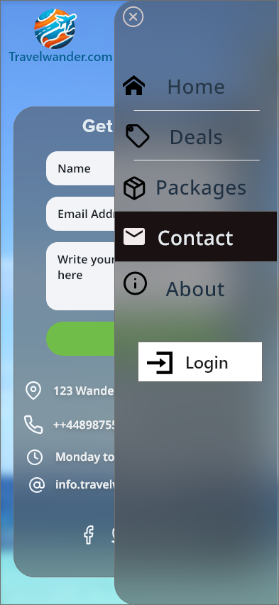

#  TravelWander

## Project Overview

TravelWander is a dynamic online platform designed to make your travel dreams come true. Our website offers a seamless and convenient way for users to explore, plan, and book holiday packages from various regions, including the USA, Europe, and Asia. With TravelWander, users can expect a one-stop solution for all their travel needs, including:

- Easy booking of holiday packages to exciting destinations.
- Personalized recommendations based on your interests and budget.
- Access to a wide range of travel options, from relaxing getaways to adventurous journeys.
- User-friendly interface for hassle-free navigation map.
- Secure payment options for peace of mind and telephone numbers to contact.
- A wealth of information on destinations, itineraries, and travel tips.
- Customer support to assist you every step of the way.

Embark on a journey of discovery with TravelWander, where your dream vacations are just a click away. Start planning your next adventure today!

## Table of Contents

- [Features](#features)
- [Technologies Used](#technologies-used)
- [Installation](#installation)
- [Usage](#usage)
- [Contributing](#contributing)
- [License](#license)
- [Author](#author)
- [Acknowledgments](#acknowledgments)

## Features

TravelWander offers a wide range of features to enhance your travel planning and booking experience:

- **Interactive Map**: Explore the USA, Europe, and Asia with an interactive map highlighting holiday packages in each region.
- **Hover-Over Previews**: Get quick insights into holiday packages, including location, base price, and key details.
- **Detailed Package Listings**: Access comprehensive information on itineraries, pricing, and availability.
- **Map Integration**: Each holiday package listing comes with a half-page map showing the destination's location.
- **Pinpoint on Map**: Hover over a package to view a pinpoint on the map, indicating the holiday destination.
- **Comprehensive Package Details**: Dive deep into package details, including accommodation, facilities, and activities.
- **Secure Booking**: Enjoy secure payment processing for seamless and convenient booking.
- **Customer Support**: Contact our customer support team for assistance with questions or concerns.
- **Wishlist Creation**: Save your favorite holiday packages to a personal wishlist.
- **Side-by-Side Comparison**: Compare multiple holiday packages side-by-side to make informed choices.
- **Flight and Accommodation Booking**: Book flights and accommodations in addition to holiday packages.
- **Social Media Integration**: Share your travel plans and experiences with friends and family via social media.
- **Mobile App**: Use our mobile app for on-the-go travel planning and booking.

TravelWander is committed to providing a feature-rich platform that simplifies travel planning and booking, giving you the tools and information you need to create unforgettable vacations.

## Technologies Used

TravelWander is built using a variety of technologies and tools to provide a seamless and feature-rich travel planning and booking experience. Our tech stack includes:

- **Front-end Technologies**:

  - HTML5
  - CSS3
  - JavaScript
  - jQuery (for DOM manipulation and event handling)
- **User Interface (UI) Frameworks**:

  - Bootstrap or Material-UI (for responsive and user-friendly design)
- **Payment Processing**:

  - Stripe or PayPal (for secure payment processing)
- **Mapping and Geolocation**:

  - Google Maps API or Mapbox (for interactive maps and geolocation features)
- **Version Control**:

  - Git and GitHub (for version control and collaboration)
- **Development Tools**:

  - Visual Studio Code or other code editors
  - Browser DevTools for debugging
  - Gitpod (for cloud-based development)
- **Social Media Integration (Optional)**:

  - APIs for various social media platforms (for sharing and integration)

Our technology choices have been carefully selected to ensure a user-friendly and secure travel planning experience. We aim to leverage the power of these tools to make your journey with TravelWander as smooth and enjoyable as possible.

## Installation

Provide step-by-step instructions on how to set up and run your project locally. Include any dependencies or environment setup required.

## Usage

Explain how to use your website. Include instructions, user flow, and any important details for potential users. Provide screenshots or examples if necessary.

## Contributing

Explain how others can contribute to your project, whether through code, bug reports, or feature requests. If contributions are not accepted, make this clear.

## License

Specify the license under which your project is distributed. You can choose from various open-source licenses like MIT, Apache, or GNU.

## Author

- Your Name
- Contact Information or Links to Profiles

## Acknowledgments

- Give credit to any resources, libraries, or individuals who inspired or helped you during the project.
- Acknowledgment 1: [Description]
- Acknowledgment 2: [Description]
- ...

## UX and UI

- In this section, document decisions at each stage of the 5 planes of UX design.
- Strategy => Scope => Structure => Skeleten => Surface
- Project goals, customer goals (user stories), features, information structure, presentation, and the look and feel of your site.
- review personas and user stories

---

### Personas:

  
Persona: Family Adventurers

## Background

- **Family Name**: Müller
- **Parents**:
  - **Father**: Mark Müller
    - **Age**: 35
    - **Occupation**: Software Engineer
  - **Mother**: Emily Müller
    - **Age**: 33
    - **Occupation**: Elementary School Teacher
- **Children**:
  - **Oldest Child**: Sophie
    - **Age**: 7
  - **Youngest Child**: Noah
    - **Age**: 4

## Demographics

- **Location**: Berlin, Germany
- **Devices**: Primarily use a shared family computer and tablets.

## Goals

- **Primary Goal**: Plan family-friendly vacations with a mix of adventure and kid-friendly activities.
- **Secondary Goals**: Ensure travel plans cater to the needs and safety of young children, find affordable options, and create lasting family memories.

## Challenges

- **Challenge 1**: Balancing adventure and family-friendly activities for both adults and children.
- **Challenge 2**: Navigating travel options that accommodate the preferences and energy levels of young kids.
- **Challenge 3**: Gather enough Informations about holiday packages

## Travel Details

- **Budget**: The Müller family typically budgets around €3000 for a family vacation.
- **Preferences**:
  - **Transportation**: Prefers family-friendly modes, such as trains or flights with kid-friendly services.
  - **Accommodations**: Looks for comfortable and child-safe accommodations.
  - **Activities**: Enjoys a mix of cultural experiences, outdoor adventures, and kid-centric activities.

## Decision-Making Process

- **Research**: The family extensively researches destinations, relying on online reviews and recommendations.
- **Consultation**: Mark and Emily discuss travel options, considering the preferences and input of both parents and children.
- **Budget Consideration**: The Müller family carefully evaluates the cost of travel packages and assesses value for money.
- **Community Influence**: They value insights from other families who have similar travel goals and preferences.

## User Journey

1. **Discovery**: The Müller family explores TravelWander to find destinations suitable for family adventures.
2. **Planning**: Mark and Emily use filters to discover vacation packages with  adventurous activities .
3. **Customization**: They customize the vacation plan to include family-oriented amenities and services.
4. **Booking**: The family securely books the vacation, ensuring it meets safety standards and provides a seamless experience for the children.
5. **Post-Trip**: After the trip, they share their experiences on TravelWander, contributing to the family-friendly community.

## Needs

- **Family-Centric Packages**: Vacation options that cater to the diverse interests of both adults and children.
- **Safety Considerations**: Information on safety measures, kid-friendly accommodations, and travel tips.
- **Budget-Friendly Options**: Affordable travel packages and deals for a family of four.

## Quotes

- "We want a vacation that offers excitement for us and fun for the kids, all in a safe and family-friendly environment."
- "Finding travel options that keep our kids engaged and happy is crucial for a successful family adventure."

  By understanding the detailed travel preferences, budget considerations, and decision-making process of the Müller family, TravelWander can tailor its offerings to provide a more personalized and satisfactory experience.

  
Persona: Emma Adams

## Background

- **Full Name**: Emma Adams
- **Age**: 22
- **Occupation**: University Student

## Demographics

- **Location**: Toronto, Canada
- **Devices**: Primarily uses a laptop and smartphone for research and planning.

## Goals

- **Primary Goal**: Explore diverse cultures and gain new experiences during university breaks.
- **Secondary Goals**: Find affordable travel options, connect with fellow travelers, and discover destinations that offer a mix of adventure and relaxation.

## Challenges

- **Challenge 1**: Limited budget due to student status.
- **Challenge 2**: Balancing academic commitments with the desire for travel experiences.

## Travel Details

- **Budget**: Emma typically budgets $1500 for a budget-friendly vacation.
- **Preferences**:
  - **Transportation**: Seeks budget-friendly flights and public transportation.
  - **Accommodations**: Comfortable hostels or budget hotels.
  - **Activities**: Enjoys a mix of cultural exploration, outdoor activities, and social experiences.

## Decision-Making Process

- **Research**: Emma relies on online platforms and student travel communities for destination ideas.
- **Affordability**: Prioritizes destinations and packages that fit within her limited budget.
- **Community Engagement**: Values insights and tips from fellow students and young travelers.

## User Journey

1. **Discovery**: Emma explores TravelWander to find budget-friendly travel options for her university breaks.
2. **Filtering**: She uses filters to narrow down options based on affordability, travel dates, and student-friendly activities.
3. **Exploration**: Emma reviews detailed information about each destination, considering factors such as cultural experiences and budget-friendly activities.
4. **Decision**: She selects a travel package that aligns with her budget and interests.
5. **Booking**: Emma completes a secure booking, ensuring it fits within her academic schedule.

## Needs

- **Budget-Friendly Options**: Access to affordable travel packages that cater to student budgets.
- **Student-Focused Activities**: Packages that offer a mix of cultural exploration and social experiences suitable for young travelers.
- **Community Connection**: Engaging with a community of fellow students for travel insights and recommendations.

## Quotes

- "I want to see the world without breaking the bank, especially during my university breaks."
- "Finding destinations that offer affordable adventures and opportunities to connect with other students is essential for my travel plans."

  By understanding Emma's unique needs as a university student, TravelWander can provide tailored options that align with her budget and desire for diverse travel experiences.

  
Persona: Mark Johnson

## Background

- **Full Name**: Mark Johnson
- **Age**: 42
- **Occupation**: Marketing Manager

## Demographics

- **Location**: New York, USA
- **Devices**: Primarily uses a laptop and smartphone.

## Goals

- **Primary Goal**: Explore diverse and exciting destinations during holidays.
- **Secondary Goals**: Find travel packages that offer unique experiences, discover hidden gems, and capture memorable moments.

## Challenges

- **Challenge 1**: Limited time for vacation planning due to work commitments.
- **Challenge 2**: Seeking personalized travel experiences within a reasonable budget.

## Travel Details

- **Budget**: Mark typically allocates $5000 for an international vacation.
- **Preferences**:
  - **Transportation**: Prefers direct flights for convenience.
  - **Accommodations**: Enjoys boutique hotels with character.
  - **Activities**: Interested in cultural experiences, local cuisine, and adventure activities.

## Decision-Making Process

- **Research**: Mark relies on online travel platforms, reviews, and recommendations.
- **Efficiency**: Values time-efficient booking processes and user-friendly platforms.
- **Feedback**: Considers the experiences of fellow travelers to inform his decisions.

## User Journey

1. **Discovery**: Mark explores TravelWander to find unique and exciting travel destinations.
2. **Filtering**: He uses filters to narrow down options based on his budget, preferred activities, and travel dates.
3. **Exploration**: Mark reads detailed information about each destination and the experiences offered.
4. **Decision**: After comparing options, he selects a travel package that aligns with his interests.
5. **Booking**: Mark completes a secure and efficient booking process.

## Needs

- **Diverse Options**: Access to a variety of travel packages that cater to different interests.
- **Efficient Booking**: A streamlined and time-efficient booking process.
- **User Reviews**: Insights from other travelers to inform decision-making.

## Quotes

- "I want my vacations to be a perfect blend of adventure, culture, and relaxation."
- "Efficiency is key for me when it comes to planning vacations. I need a platform that understands my preferences and simplifies the booking process."

  By understanding Mark's preferences and priorities, TravelWander can provide a seamless and personalized experience for his vacation planning.

### User Stories:

1. **Family Adventurers (Müller Family):**

   - **Discover Family-Friendly Vacations:**
     - Explore a user-friendly interface to easily discover family-friendly vacation options on TravelWander.
   - **Customize Vacation Plans:**
     - Utilize a simple and intuitive platform to customize vacation plans, considering the needs of both adults and children.
   - **Access Comprehensive Information:**
     - Find comprehensive information on safety measures, kid-friendly accommodations, and valuable travel tips.
   - **Flexible Itineraries:**
     - Choose from flexible itineraries that cater to the interests and energy levels of both adults and children.
   - **Engage with the Community:**
     - Connect with and contribute to the family-friendly community on TravelWander.
2. **Emma Adams (University Student):**

   - **Explore Budget-Friendly Options:**
     - Navigate a visually engaging platform to explore budget-friendly travel options for university breaks.
   - **Efficient Filtering:**
     - Use efficient filtering options to explore travel packages based on affordability, travel dates, and student-friendly activities.
   - **Detailed Destination Information:**
     - Access detailed information about each destination, including cultural experiences and budget-friendly activities.
   - **Secure Booking Process:**
     - Experience a secure and efficient booking process that accommodates academic schedules.
   - **Connect with Fellow Students:**
     - Connect with a community of fellow students for travel insights and recommendations.
3. **Solo Explorer (Mark Johnson):**

   - **Visually Engaging Discovery:**
     - Discover unique and exciting destinations through a visually engaging platform on TravelWander.
   - **Efficient Filtering Options:**
     - Use efficient filtering options to explore travel packages based on budget, preferred activities, and travel dates.
   - **Informed Decision-Making:**
     - Access detailed information about each destination to make informed decisions about solo adventures.
   - **Streamlined Booking Process:**
     - Enjoy a streamlined and secure booking process for the selected travel package.

## Wireframes

- Provide links to wireframes that serve as blueprints for your site. Include wireframes for different screen sizes (mobile, tablet, desktop).
-   - -- ----third lists and map hotels --

--

--

## Mock-ups (Optional)

- If available, showcase images that represent how your finished site looks on different screen sizes.

## Testing (To Be Added)

- Used Map box api for generate map base of hotels address  [mapbox Api link ](https://www.mapbox.com)
- I have been using Rapidapi/booking [booking api link](https://rapidapi.com/apidojo/api/booking) but their system and api cost alot so decided to use local Json data file for fetching Data results
- Used and testing weather open api for fetching recent information [Api link](https://api.openweathermap.org) used for flags html
- By using json file tried to create **dynamic web page**

## Next Steps (Optional)

- Mention what's coming next in your project, new features, or planned improvements.
