# TravelWander.com

Explore the world through TravelWander.com, your ultimate travel companion.

Visit the live site: [TravelWander.com](https://maisam2004.github.io/Travelwander/)

Embark on a virtual journey, discover new destinations, and plan your next adventure!

## Contents

- [User Experience](#user-experience-ux)
  - [User Stories](#user-stories)
- [Design](#design)
  - [Colour Scheme](#colour-scheme)
  - [Typography](#typography)
  - [Imagery](#imagery)
  - [Wireframes](#wireframes)
  - [Features](#features)
    - [Destination Discovery](#destination-discovery)
    - [Travel Guides](#travel-guides)
    - [User Profiles](#user-profiles)
    - [Interactive Maps](#interactive-maps)
    - [Future Enhancements](#future-enhancements)
  - [Accessibility](#accessibility)
- [Technologies Used](#technologies-used)
  - [Languages Used](#languages-used)
  - [Frameworks, Libraries &amp; Programs Used](#frameworks-libraries--programs-used)
- [Deployment &amp; Local Development](#deployment--local-development)
  - [Deployment](#deployment)
  - [Local Development](#local-development)
    - [How to Fork](#how-to-fork)
    - [How to Clone](#how-to-clone)
- [Testing](#testing)
  - [Solved Bugs](#solved-bugs)
  - [Known Bugs](#known-bugs)
- [Credits](#credits)
  - [Code Used](#code-used)
  - [Content](#content)
  - [Media](#media)
  - [Acknowledgments](#acknowledgments)

---

## User Experience (UX)

### User Stories

#### First Time Visitor Goals

- I want to explore new travel destinations and get inspired for my next trip.
- I want a user-friendly interface that allows me to navigate through the site effortlessly.
- I want to find comprehensive travel guides and information about different countries holiday packages

#### Returning Visitor Goals

- I want to interact with an interactive map to plan my itinerary effectively.

#### Frequent Visitor Goals

- I want to contribute by sharing my travel experiences and tips.
- I want to connect with other travel enthusiasts through user profiles.

---

## Design

### Colour Scheme

The color scheme is carefully selected to evoke a sense of adventure and wanderlust. Earthy tones and vibrant blues are used to represent the beauty of nature and the vastness of the world.

- Primary Colour: `#355c7d` (Deep Blue)
- Secondary Colour: `#6c5b7b` (Plum)
- Accent Colour: `#c06c84` (Dusty Rose)
- Background: `#f8b400` (Bright Yellow)

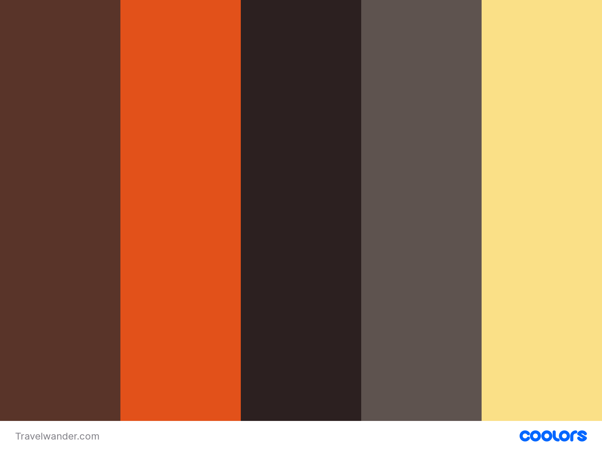

### Typography

The chosen fonts are both modern and easy to read, enhancing the overall user experience.

- Page Title: [Roboto Slab italic](https://fonts.google.com/specimen/Roboto?query=roboto)
- Body Text: [Open Sans](https://fonts.google.com/specimen/Open+Sans)
- Body text : [Roboto](https://fonts.google.com/specimen/Roboto?query=roboto)
  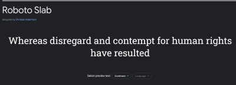

### Imagery

Stunning images of landscapes and iconic landmarks are incorporated to transport users to different corners of the world. Each page features visually appealing photos to enhance the travel experience.

### Wireframes

Wireframes for mobile, tablet/desktop were created using Adobe xd.

Hompage desktop and mobile

- -

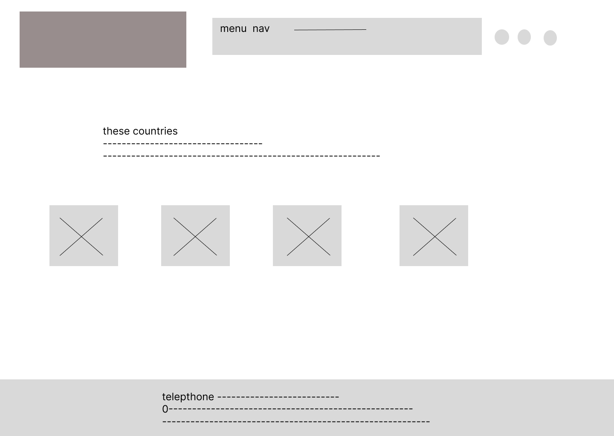-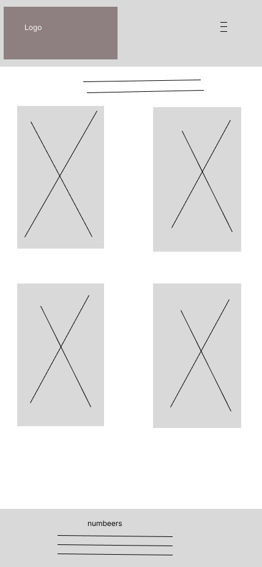 
--third lists and map hotels --
- 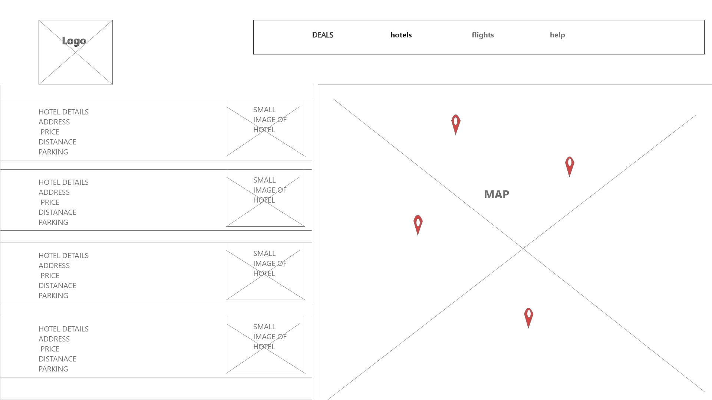
- 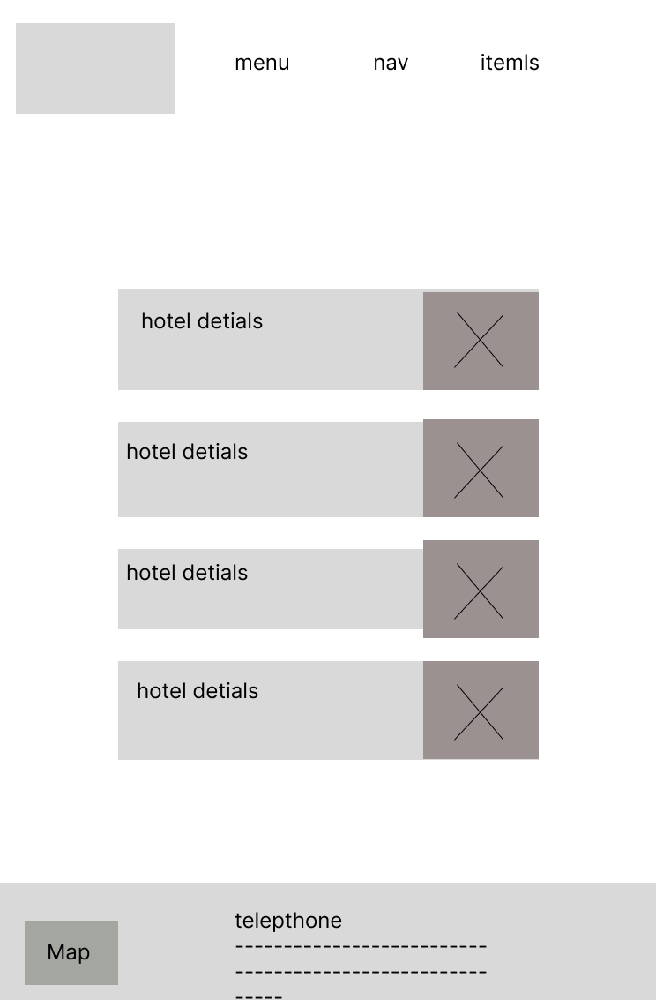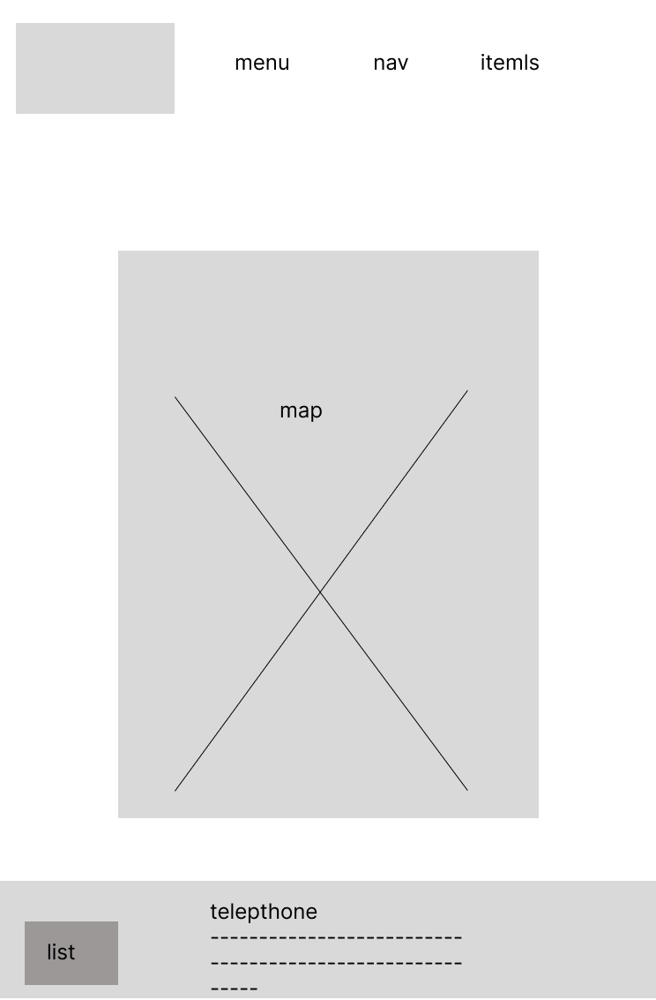

updated

- 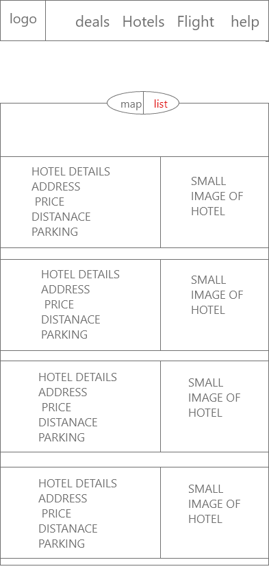 - 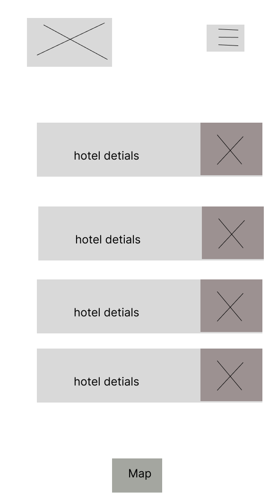
- 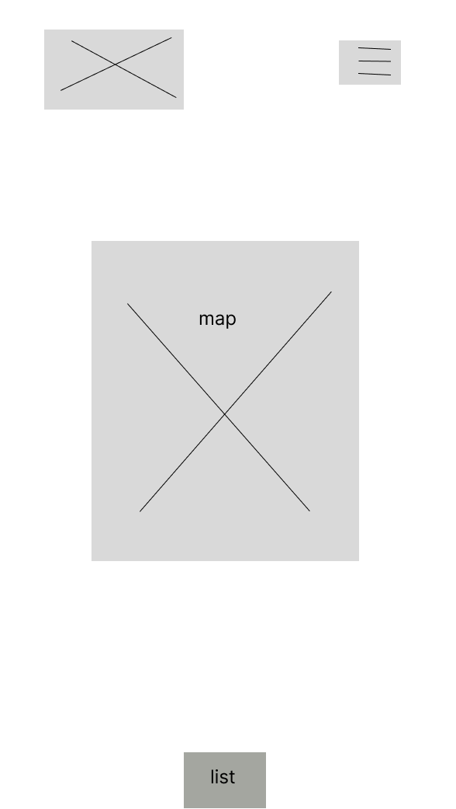
- 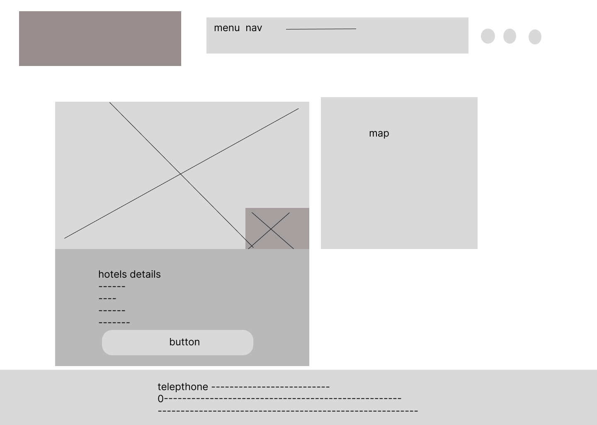
- 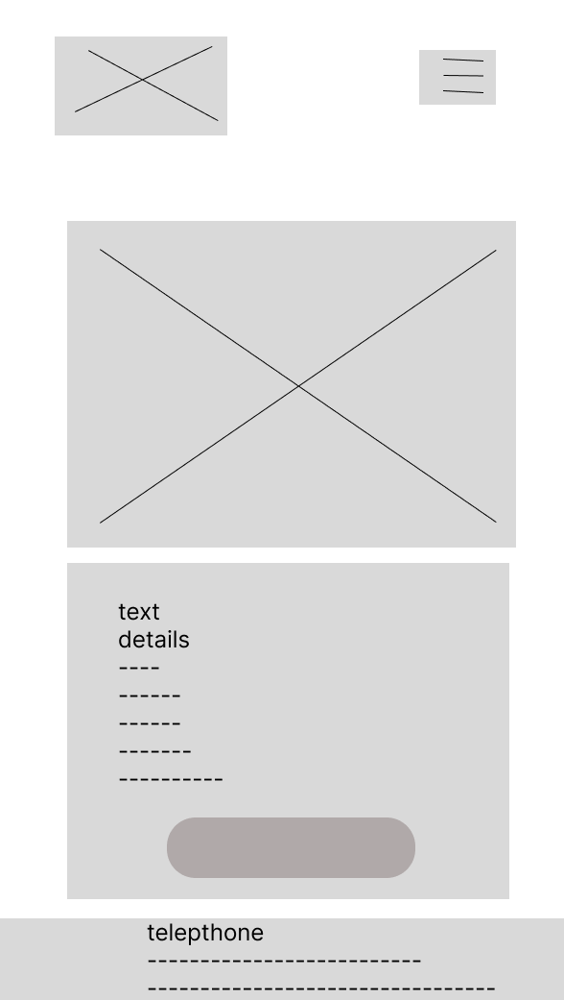

### Features

Explore the rich features of TravelWander.com, designed to provide an immersive and dynamic experience for users.

1. **Responsive Design:**

   - All pages are seamlessly responsive, ensuring a consistent and enjoyable user experience across mobile, tablet, and desktop devices.
     and on mobile add grid system to show menu by click on hamburger lines.
2. **Dynamic Content:**

   - The website's content is dynamic, sourced partly from APIs and a locally created JSON file. This ensures up-to-date information and a diverse range of travel details and weather information.
3. **Favicon Integration:**

   - The site incorporates a distinctive favicon, enhancing brand visibility in the browser. 
4. **Logo Navigation:**

   - The logo at the top of each page functions as a clickable link to the homepage, providing convenient navigation. This feature is implemented using JavaScript.
5. **Hero Video:**

   - The first page features a captivating hero section with a video, setting the tone for an engaging exploration of travel destinations.
6. **Continent Slides:**

   - Above the video, three slides showcase stunning photos of different continents, offering a visual preview of the diverse destinations available.
7. **Text Background Enhancement:**

   - To enhance readability, a blur drop shadow is applied as the background for text in certain sections. This ensures a comfortable reading experience, especially for information about the company and reviews.
8. **Footer with Telephone Link:**

   - Most pages include a footer with a telephone link. Users can click on the link to open a window for a quick call, providing easy access to support or inquiries.

Feel the wanderlust and enjoy the seamless features of TravelWander.com .

#### Home Page

The homepage of TravelWander.com offers a captivating introduction to the travel experience, blending aesthetics and functionality seamlessly.

- **Site Name and Logo:**

  - The site name and logo take center stage, creating a distinctive visual identity for TravelWander.com.
- **Navbar:**

  - An intuitive navigation bar ensures easy exploration, allowing users to effortlessly access different sections of the website.
- **Social Icons:**

  - Social icons are strategically placed, providing quick links to connect with TravelWander.com on various social media platforms.
- **Welcome Text:**

  - A warm welcome text invites users to embark on a virtual journey, setting the tone for an immersive travel experience.
- **Continents Slides:**

  - Three slides showcasing breathtaking images of different continents create a visually stunning backdrop, offering a glimpse into the diverse destinations awaiting exploration.
- **Company Information:**

  - Information about the company is elegantly presented, providing insights into TravelWander's mission and offerings.
- **Customer Reviews:**

  - Customer reviews add a personal touch, offering authentic perspectives and enhancing the credibility of the travel services.
- **Background Video:**

  - A dynamic background video runs throughout the homepage, adding a touch of dynamism and reinforcing the travel theme.

Experience the allure of TravelWander.com's homepage, where aesthetics meet functionality to inspire your wanderlust.

- 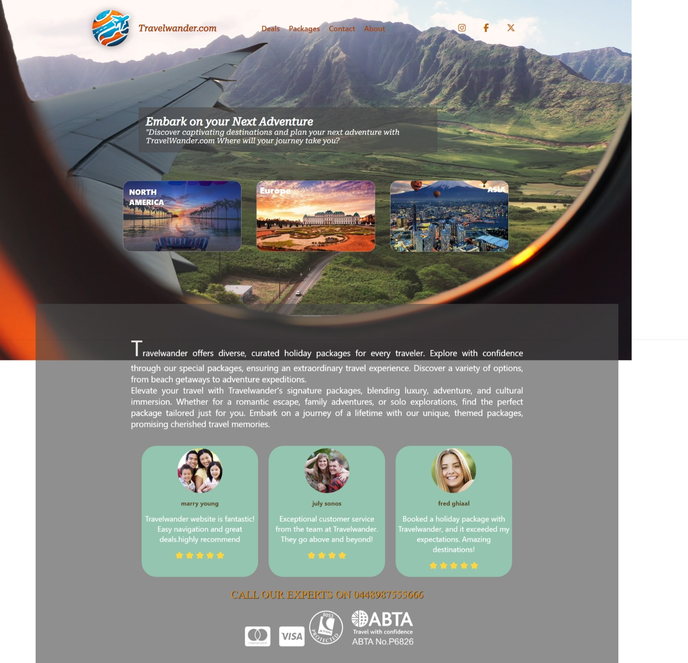
- 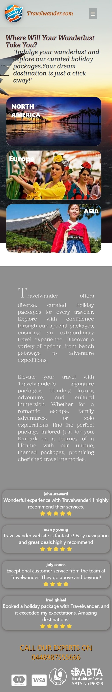

#### Destination Discovery

- Embark on a journey of exploration with TravelWander.com's Destination Discovery feature. Delve into a diverse collection of travel destinations, each represented by its unique flag. Begin your adventure by selecting a continent on the first page, where you'll find concise information about the weather and the cost of holiday packages from your chosen destination.
- 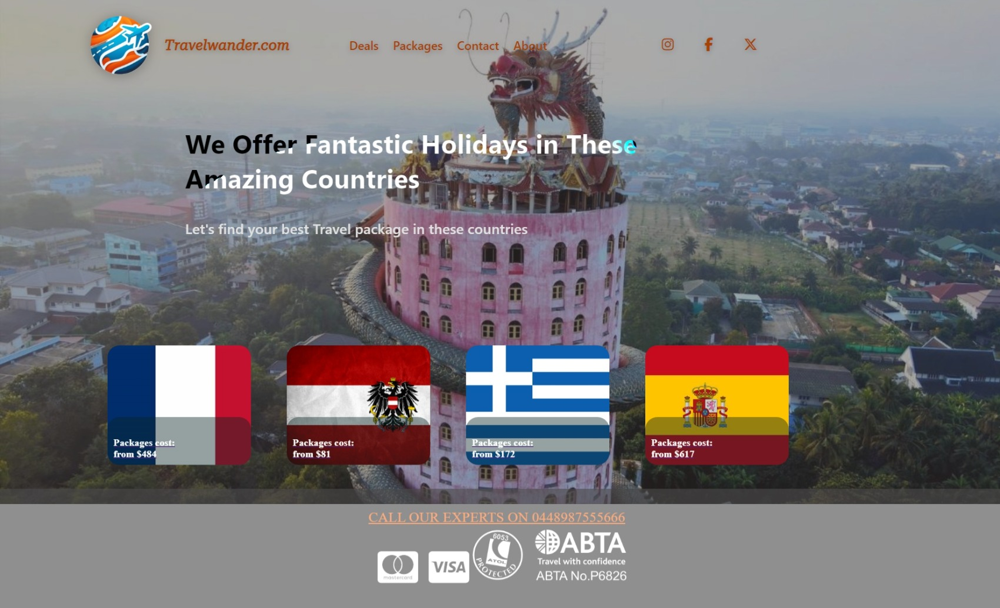

#### Interactive Maps

-Immerse yourself in the Interactive Maps experience, where each flag is a gateway to exciting holiday packages and detailed insights about the chosen country. With a simple click on a flag, you'll be transported to a wealth of travel information. Plan your itinerary, visualize travel routes, and make informed decisions to tailor your dream vacation with TravelWander.com.

- 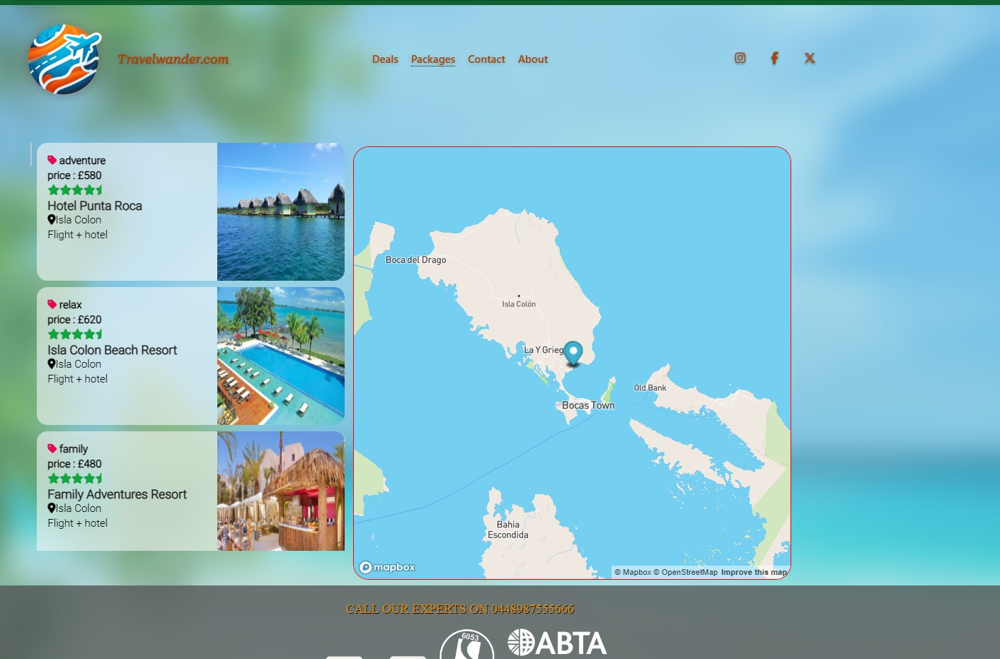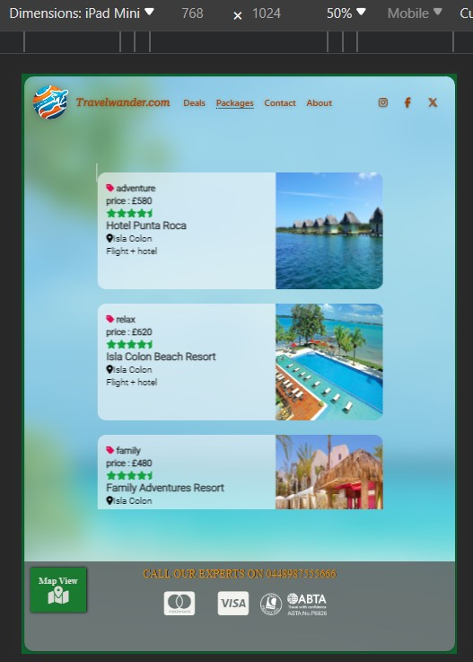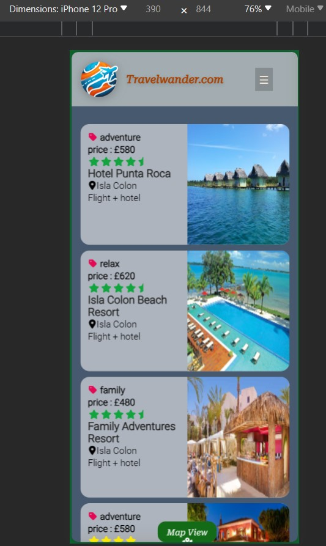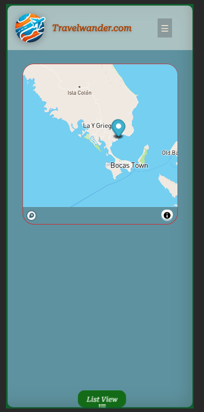

Package Details
Discover the essence of your chosen destination with a comprehensive overview. This page unfolds the allure of your selected hotel through captivating images and an interactive map. Delve into the specifics of available hotel packages, showcasing key details to assist you in making an informed decision. When ready to embark on your journey, a convenient "Reserve" button awaits your click. Engage with the button to reveal a modal form, prompting you to provide necessary information for a personalized quote. Your seamless travel experience begins here.

#### Future Enhancements

- Integration with social media platforms for easy sharing of travel experiences.
- Real-time collaboration on travel itineraries with friends.
- Language translation features for global accessibility.
- Add new API from travel agency to be able booked on page

### Accessibility

The website prioritizes accessibility with:

- Semantic HTML5 elements for improved screen reader compatibility.
- High color contrast for text and background elements.
- Focus states on interactive elements for clear navigation.

---

## Technologies Used

### Languages Used

- HTML5
- CSS3
- JavaScript

### Frameworks, Libraries & Programs Used

- [Google Fonts](https://fonts.google.com/)
- [Figma](https://www.figma.com/)- Used to create wireframes.
- [Adobe xd ](https://www.adobe.com/) - Used to create wireframes.
- [GitHub](https://github.com/)
- [Git](https://git-scm.com/)
- [Visual Studio Code](https://code.visualstudio.com/)
- [Mapbox API ](https://api.mapbox.com/)-used to impliment map in pages
- [Open weather map  ](https://openweathermap.org/)-to show current weather information
- [Canva ](https://www.canva.com/create/logos/)-used to create logo for page
- [Unsplashed](https://unsplash.com/) -used for photos and videos

---

## Deployment & Local Development

### Deployment

The site is deployed using GitHub Pages. The main branch serves as the deployment branch, and updates are reflected automatically.

To deploy the site:

1. Fork the repository.
2. Go to the repository settings on GitHub.
3. Scroll down to the GitHub Pages section.
4. Choose the main branch as the source.

### Local Development

#### How to Fork

1. On GitHub, navigate to the repository.
2. In the top-right corner, click "Fork."
3. After forking, you'll have your copy of the repository.

#### How to Clone

1. On GitHub, navigate to your fork of the repository.
2. Click the green "Code" button.
3. Copy the URL.
4. Open your terminal.
5. Change the current working directory to the location where you want the cloned directory.
6. Type `git clone`, paste the URL, and press Enter.

---

## Testing

### Contents

- [Automated Testing](#automated-testing)
  - [W3C Validator](#w3c-validator)
  - [JavaScript Validator](#javascript-validator)
  - [Lighthouse](#lighthouse)
- [Manual Testing](#manual-testing)
  - [Testing User Stories](#testing-user-stories)
  - [Full Testing](#full-testing)

---

### Automated Testing

#### W3C Validator

- **index.html**: Passed.
- **packagesall.html**: No errors, 1 Warning. The warning is for an empty H2 tag. This is where package details are inserted dynamically.
- **flags.html**: Passed.
- **contact.html**: Passed.
- **about.html**: Passed.
- **hotel_details.html**: Passed.
- **style.css**: Passed, no errors found.
- **style.css**: Passed.
- **packagesall.css**: passed.
- **flags.css**: Passed.
- **contact.css**: Passed.
- **about.css**: Passed.
- **hotel_details.css**: Passed.
- **style.css**: Passed, no errors found.

#### JavaScript Validator

- **main.js**: Passed.
- **packages.js**: Passed with one warning. Async functions are only available in ES8. It also stated that there are 4 unused variables; however, these are being used.
- **destinations.js**: Passed.

#### Lighthouse

I used Lighthouse within the Chrome Developer Tools to test the performance, accessibility, best practices, and SEO of the website.

**Desktop Results**
All pages of the site are achieving a score of 95 and above across the 4 categories.

- **index.html**
- **packages.html**
- **destinations.html**
- **404.html**
- **500.html**

**Mobile Results**
Each page is achieving a score of 90 and above for the last three categories. The performance category is achieving a score of 85 for the first three pages and a score of 88 on the 404 & 500 pages.

- **index.html**
- **packages.html**
- **destinations.html**
- **404.html**
- **500.html**

---

### Manual Testing

#### Testing User Stories

**First Time Visitors**

| Goals                                                                         | How are they achieved?                                                                                |
| ----------------------------------------------------------------------------- | ----------------------------------------------------------------------------------------------------- |
| I want to explore travel destinations and available packages.                 | The TravelWander website provides a variety of destinations and travel packages for users to explore. |
| I want to easily navigate through the website to find the information I need. | Intuitive navigation and clear calls-to-action are implemented for easy exploration.                  |
| I want visually appealing content that showcases destinations and packages.   | High-quality images and well-crafted content are used to visually engage first-time visitors.         |

**Returning Visitors**

| Goals                                                              | How are they achieved?                                                                                 |
| ------------------------------------------------------------------ | ------------------------------------------------------------------------------------------------------ |
| I want to review and compare travel packages efficiently.          | The packages page allows users to view and compare details of various travel packages easily.          |
| I want to find new and exciting destinations to plan my next trip. | The destinations page highlights different travel spots, providing inspiration for returning visitors. |

**Frequent Visitors**

| Goals                                                             | How are they achieved?                                                                                |
| ----------------------------------------------------------------- | ----------------------------------------------------------------------------------------------------- |
| I want to check for any new travel packages or updates regularly. | A blog or news section keeps frequent visitors informed about new packages, travel tips, and updates. |
| I want a seamless booking experience for selected packages.       | The booking process is streamlined, providing an efficient and user-friendly experience.              |

#### Full Testing

Full testing was performed on the following devices:

**Laptop:**

- MacBook Pro 2021 13-inch screen

**Mobile Devices:**

- iPhone 12 Pro.
- Samsung Galaxy S21.

Each device tested the site using the following browsers:

- Google Chrome
- Safari
- Firefox

Additional testing was undertaken by friends and family on a variety of devices and screen sizes. They reported no issues when browsing and exploring the website.

**Home Page**

| Feature                       | Expected Outcome                                                              | Testing Performed             | Result                                  | Pass/Fail |
| ----------------------------- | ----------------------------------------------------------------------------- | ----------------------------- | --------------------------------------- | --------- |
| The Site's logo               | Clicking the logo directs the user back to the home page                      | Clicked on the logo           | Home page reloads                       | Pass      |
| Navigation menu               | Easy navigation to different sections (Packages, Destinations, Blog, Contact) | Clicked on each menu item     | Navigated to the corresponding sections | Pass      |
| Search functionality          | Efficient search for specific destinations or packages                        | Typed in search queries       | Relevant results were displayed         | Pass      |
| Featured destinations section | Visually appealing display of popular travel spots                            | Scrolled through the section  | Images and details were engaging        | Pass      |
| Call-to-action buttons        | Prominent buttons for booking or exploring packages                           | Clicked on "Explore Packages" | Redirected to the Packages page         | Pass      |

**Packages Page**

| Feature         | Expected Outcome                                       | Testing Performed                | Result                                                | Pass/Fail |
| --------------- | ------------------------------------------------------ | -------------------------------- | ----------------------------------------------------- | --------- |
| Package cards   | Clear display of package details and prices            | Checked each package card        | Information and prices were displayed accurately      | Pass      |
| Filter options  | Easy filtering based on destination, price range, etc. | Used the filter options          | Packages were filtered according to selected criteria | Pass      |
| Package details | Clicking on a package card opens detailed information  | Clicked on a package card        | Detailed information about the package was displayed  | Pass      |
| Booking button  | Seamless experience for booking a selected package     | Clicked on the "Book Now" button | Redirected to the booking page                        | Pass      |

**Destinations Page**

| Feature             | Expected Outcome                                          | Testing Performed                    | Result                                                    | Pass/Fail |
| ------------------- | --------------------------------------------------------- | ------------------------------------ | --------------------------------------------------------- | --------- |
| Destination cards   | Engaging display of different travel destinations         | Checked each destination card        | Information and images were visually appealing            | Pass      |
| Filter options      | Easy filtering based on region, type, etc.                | Used the filter options              | Destinations were filtered according to selected criteria | Pass      |
| Destination details | Clicking on a destination card opens detailed information | Clicked on a destination card        | Detailed information about the destination was displayed  | Pass      |
| Explore button      | Quick access to explore more about a selected destination | Clicked on the "Explore More" button | Redirected to a detailed page about the destination       | Pass      |

**Blog Page**

| Feature              | Expected Outcome                          | Testing Performed                    | Result                                        | Pass/Fail |
| -------------------- | ----------------------------------------- | ------------------------------------ | --------------------------------------------- | --------- |
| Blog posts           | Informative and engaging blog posts       | Checked multiple blog posts          | Content was informative and engaging          | Pass      |
| Search functionality | Efficient search for specific blog topics | Typed in search queries              | Relevant blog posts were displayed            | Pass      |
| Navigation           | Easy access to different blog categories  | Clicked on different blog categories | Navigated to the corresponding category pages | Pass      |
| Read more button     | Full access to read the entire blog post  | Clicked on "Read More"               | Redirected to the full blog post              | Pass      |

**Contact Page**

| Feature            | Expected Outcome                             | Testing Performed             | Result                                             | Pass/Fail |
| ------------------ | -------------------------------------------- | ----------------------------- | -------------------------------------------------- | --------- |
| Contact form       | User-friendly form for inquiries or feedback | Filled out the contact form   | Form submission successful                         | Pass      |
| Social media links | Quick access to social media profiles        | Clicked on social media icons | Redirected to the respective social media profiles | Pass      |
| Map integration    | Display of office location using Google Maps | Checked the map section       | Office location displayed accurately               | Pass      |

**404 Error Page**

| Feature          | Expected Outcome                                             | Testing Performed                       | Result                                              | Pass/Fail |
| ---------------- | ------------------------------------------------------------ | --------------------------------------- | --------------------------------------------------- | --------- |
| Navigation links | Options to return to the home page or explore other sections | Clicked on "Go Home" and "Explore More" | Redirected to the home page and respective sections | Pass      |
| Visual elements  | Engaging visuals and clear messaging                         | Reviewed the overall appearance         | Visually appealing and clear messaging              | Pass      |

**500 Error Page**

| Feature          | Expected Outcome                                             | Testing Performed                       | Result                                              | Pass/Fail |
| ---------------- | ------------------------------------------------------------ | --------------------------------------- | --------------------------------------------------- | --------- |
| Navigation links | Options to return to the home page or explore other sections | Clicked on "Go Home" and "Explore More" | Redirected to the home page and respective sections | Pass      |
| Visual elements  | Engaging visuals and clear messaging                         | Reviewed the overall appearance         | Visually appealing and clear messaging              | Pass      |

---

## Credits

### Code Used

- While utilizing an API that presented correct and incorrect answers, I employed the Fisher-Yates Shuffle to randomize answer placement on buttons, ensuring a balanced distribution. I referred to a YouTube tutorial for further optimization based on my data structure. Special thanks to the tutorial, and gratitude to RapidAPI for streamlined access to essential resources.
- Custom scroll animations: Inspired by [AOS Library](https://michalsnik.github.io/aos/). try to learn from some of code sample
- Responsive navigation menu: Adapted from [W3Schools](https://www.w3schools.com/howto/howto_js_responsive_navbar.asp).
- implement map in a page by [Mapbox video](https://www.youtube.com/watch?v=kzPdpZ1BDG4&t=1s)

### Content

- Travel guides and information: Curated from various travel blogs and resources.
- User reviews: Provided by the TravelWander.com community.

### Media

- Stunning travel images: Sourced from [Unsplash](https://unsplash.com/) and [Pexels](https://www.pexels.com/).
  -Used [Videezy](https://www.videezy.com/) for hompage background

### Acknowledgments

- My mentor for invaluable guidance and support.
- The travel community for sharing their passion and insights.
- Code Institute for the educational resources and challenges.

---

Thank you for exploring the world with TravelWander.com!
